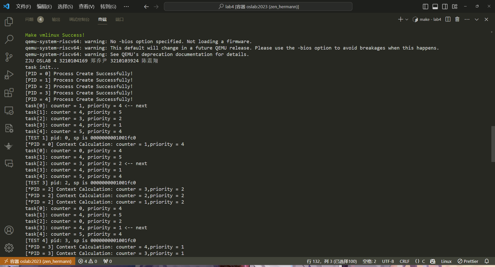
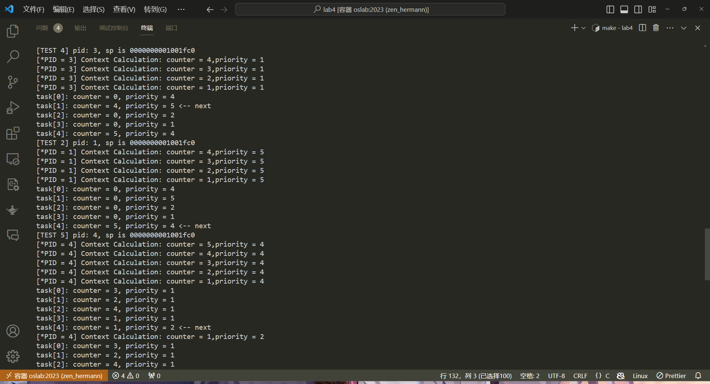
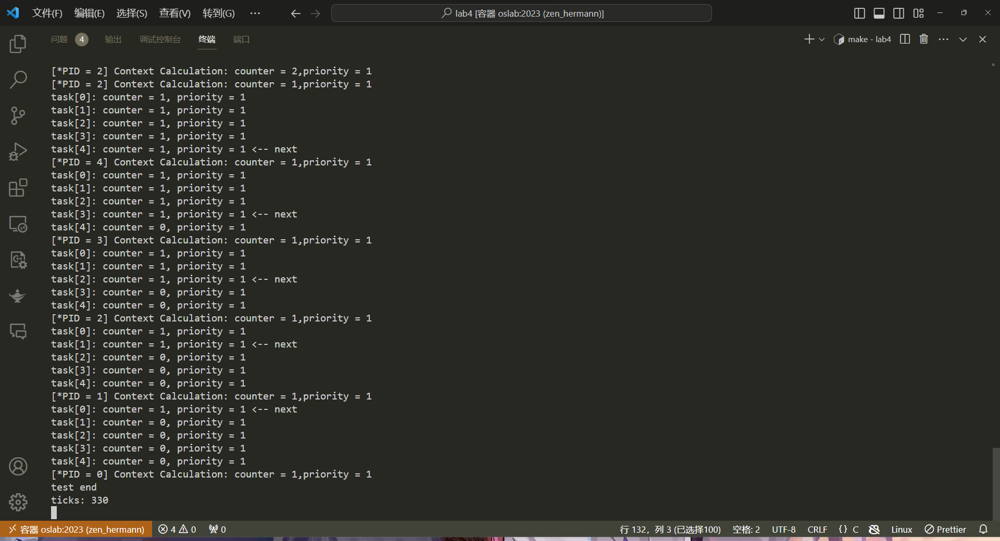

# Lab 4: RV64 用户模式

<a name="ca927a96"></a>
# 1 实验目的


- 实现用户态的系统调用函数，并完善内核功能。


<a name="1bdb1875"></a>
# 2 实验内容及要求


- 完成函数库的系统调用函数。
- 完成内核中相关函数，为内核添加系统调用功能。


<br />请各小组独立完成实验，任何抄袭行为都将使本次实验判为0分。<br />
<br />**请跟随实验步骤完成实验并根据文档中的要求记录实验过程，最后删除文档末尾的附录部分**，并命名为“**学号1_姓名1_学号2_姓名2_lab4.pdf**"，你的代码请打包并命名为“**学号1_姓名1_学号2姓名2_lab4**"，文件上传至学在浙大平台。<br />
<br />本实验以双人组队的方式进行，**仅需一人提交实验，**默认平均分配两人的得分（若原始打分为X，则可分配分数为2X，平均分配后每人得到X分）。如果有特殊情况请单独向助教反应，出示两人对于分数的钉钉聊天记录截图。单人完成实验者的得分为原始打分。

| 姓名 | 学号 | 分工 | 分配分数 |
| --- | --- | --- | --- |
| 陈震翔 | 3210103924 | 完成一份lab4 | 50% |
| 郑乔尹 | 3210104169 | 完成一份lab4 | 50% |


<a name="b617e20b"></a>
# 3 实验步骤


<a name="95097dcc"></a>
## 3.1 环境搭建

<br />你可以从 [lab4.zip](https://yuque.zju.edu.cn/attachments/yuque/0/2023/zip/32491/1700734467493-7d55c143-0737-4d00-a864-fe95976beb9f.zip?_lake_card=%7B%22uid%22%3A%221700734466820-0%22%2C%22src%22%3A%22https%3A%2F%2Fyuque.zju.edu.cn%2Fattachments%2Fyuque%2F0%2F2023%2Fzip%2F32491%2F1700734467493-7d55c143-0737-4d00-a864-fe95976beb9f.zip%22%2C%22name%22%3A%22lab4.zip%22%2C%22size%22%3A51201%2C%22type%22%3A%22application%2Fzip%22%2C%22ext%22%3A%22zip%22%2C%22progress%22%3A%7B%22percent%22%3A99%7D%2C%22status%22%3A%22done%22%2C%22percent%22%3A0%2C%22id%22%3A%22n00It%22%2C%22card%22%3A%22file%22%7D) 下载本实验提供好的代码。<br />

```shell
.
├── Makefile
├── arch
│   └── riscv
│       ├── Makefile
│       ├── kernel
│       │   └── ...
│       └── user
│           ├── Makefile
│           ├── lib 												// 用户应用程序运行库
│           │   ├── Makefile
│           │   ├── include
│           │   │   ├── getpid.h
│           │   │   ├── stddef.h
│           │   │   ├── stdio.h
│           │   │   ├── syscall.h
│           │   │   └── types.h
│           │   └── src
│           │       ├── getpid.c
│           │       ├── printf.c
│           │       └── syscall.c
│           ├── src													// 用户应用程序源代码
│           │   ├── Makefile
│           │   ├── test1.c
│           │   ├── test2.c
│           │   ├── test3.c
│           │   ├── test4.c
│           │   └── test5.c
│           └── users.S
└── include
    ├── defs.h
    ├── riscv.h
    ├── sched.h
    ├── stddef.h
    ├── stdio.h
    ├── syscall.h
    ├── task_manager.h
    ├── test.h
    └── vm.h
```


<a name="0657c377"></a>
### 3.2 应用程序执行环境

<br />经过了lab1~lab3，我们已经为我们的内核实现了丰富的功能，包括字符串打印，时钟中断，进程管理，地址空间等，并且为用户进程分配了内核栈与用户栈。基于这些功能，我们已经可以实现功能丰富的用户应用程序了。在lab4中，我们把用户应用程序的代码独立出来，放在了`arch/riscv/user/src`文件夹下。<br />
<br />当我们在自己的计算机上编程时，离不开标准库的支持（比如`iostream`），而这些标准库离不开操作系统的支持。以字符串打印为例，经过硬件课的学习，我们知道字符串输出实际上是在一个物理地址上填写字符内容，然后硬件读取该地址后完成在屏幕上的输出。在我们的代码中是`putchar()`函数来负责这一功能：<br />

```c
int putchar(const char c) {
  *UART16550A_DR = (unsigned char)(c);
  return (unsigned char)c;
}
```

<br />因此当我们在调用`iostream`的输出函数时，实际上最终的输出是os负责完成的。因此我们需要一层接口来“告诉”os，我们想要打印个字符串，这层接口就是**系统调用**。用户应用程序、os、硬件之间的层级关系如下图所示：<br />
<br /><br />
<br />我们的应用位于最上层，它可以通过调用编程语言提供的标准库或者其他第三方库对外提供的函数接口，使得仅需少量的源代码就能完成复杂的功能。但是这些库的功能不仅限于此，事实上它们属于应用程序 **执行环境** (Execution Environment)的一部分。在我们通常不会注意到的地方，这些软件库还会在执行应用之前完成一些初始化工作，并在应用程序执行的时候对它进行监控。<br />

> 我们在实现os的时候使用了编译参数 -nostdlib，这就是在告诉编译器不要使用标准库。因为标准库需要os的支持才能实现，自然不能在os里直接用了。


<br />所以在我们开始实现用户程序之前，我们还需要实现一些函数库，函数库的代码被放在了`arch/riscv/user/lib`文件夹下。<br />

> 为什么不用通用的标准库？因为我们的os还不够“强大”，很多功能并不支持，而我们并不知道在通用的标准库中究竟用到了os的哪些功能。


> **多层执行环境都是必需的吗？**
> 除了最上层的应用程序和最下层的硬件平台必须存在之外，作为中间层的函数库和操作系统内核并不是必须存在的： 它们都是对下层资源进行了 **抽象** (Abstraction/Indirection)，并为上层提供了一个执行环境（也可理解为一些服务功能）。抽象的优点在于它让上层以较小的代价获得所需的功能，并同时可以提供一些保护。但抽象同时也是一种限制，会丧失一些应有的灵活性。比如，当你在考虑在项目中应该使用哪个函数库的时候，就常常需要这方面的权衡：过多的抽象和过少的抽象自然都是不合适的。理解应用的需求也很重要。一个能合理满足应用需求的操作系统设计是操作系统设计者需要深入考虑的问题。这也是一种权衡，过多的服务功能和过少的服务功能自然都是不合适的。
> 实际上，我们通过应用程序的特征和需求来判断操作系统需要什么程度的抽象和功能。
> - 如果函数库和操作系统内核都不存在，那么我们就需要手写汇编代码来控制硬件，这种方式具有最高的灵活性，抽象能力则最低，基本等同于编写汇编代码来直接控制硬件。我们通常用这种方式来实现一些架构相关且仅通过高级编程语言无法描述的小模块或者代码片段。
> - 如果仅存在函数库而不存在操作系统内核，意味着我们不需要操作系统内核提供过于通用的抽象。在那些功能单一的嵌入式场景就常常会出现这种情况。嵌入式设备虽然也包含处理器、内存和 I/O 设备，但是它上面通常只会同时运行一个或几个功能非常简单的小应用程序，比如定时显示、实时采集数据、人脸识别打卡系统等。常见的解决方案是仅使用函数库构建单独的应用程序或是用专为应用场景特别裁减过的轻量级函数库管理少数应用程序。这就只需要一层函数库形态的执行环境。
> - 如果存在函数库和操作系统内核，这意味着应用需求比较多样，会需要并发执行。常见的通用操作系统如 Windows/Linux/macOS 等都支持并发运行多个不同的应用程序。为此需要更加强大的操作系统抽象和功能，也就会需要多层执行环境。
> 
实际上，我们的os实验排布和os的发展历史并不吻合甚至相反。在计算机系统的发展过程中，首先没有os，为了方便应用程序的开发，有了以函数库存在的原始os；然后为了提高计算机处理多道程序的能力，出现了具有进程管理功能的os，然后才出现了地址空间等等功能。用户应用程序是os的出发点，而不是结果。


<a name="f79b48ad"></a>
### 3.3 添加系统调用处理函数


<a name="a1e4d6c9"></a>
#### 3.3.1 将 ecall from u-mode 委托给 S 模式处理

<br />在 RISC-V 中系统调用通过 `ecall`（environment call）来实现。在 U-mode、S-mode、M-mode下执行 `ecall` 分别会触发 environment-call-from-U-mode 异常、environment-call-from-S-mode 异常、environment-call-from-M-mode 异常。在系统调用的实现中，我们通过在 U-mode 下执行 `ecall` 触发 environment-call-from-U-mode 异常，并由 S-mode 中运行的内核处理这个异常。<br />
<br />还记得 Lab 1 中使用的 `sbi_call` 函数吗？本实验添加系统调用处理函数的方式如出一辙。用户态首先设置好 `a0` ~ `a7` 寄存器作为参数，然后通过调用 `ecall` 来进入内核态，内核态根据 `a0` ～ `a7` 这些参数做处理，完成后再通过 `a0` ～ `a1` 寄存器传出返回值。<br />
<br />第一步，你需要在 head.S 中内核 boot 阶段时，设置 medeleg 寄存器为用户模式系统调用添加异常委托。在没有设置异常委托的情况下，`ecall` 指令产生的异常由 M-mode 来处理，而不是交由内核所在的 S-mode 进行处理。通过 medeleg 中设置相应的位，可以将 environment-call-from-U-mode 异常直接交由 S-mode 处理。<br />
<br />**请在下方代码框中补充完整你的代码：**<br />

```
// head.S

# TODO: 把用户系统调用（syscall_from_U_mode）委托给 S 模式处理
```


<a name="6e9804d1"></a>
#### 3.3.2 设置sstatus

<br />另外，为了让内核可以访问用户的地址空间，我们需要在_supervisor中设置sstatus.sum = 1，使得S态可以访问U态的地址空间，便于后续的字符串输出。<br />
<br />

```shell
	// head.S
  
  # TODO: 设置sstatus.sum = 1，使得S态可以访问U态的地址空间，便于后续的字符串输出
  li t1, 0x40000
  csrs sstatus, t1

```
<a name="OQFMv"></a>
#### 
<a name="qENac"></a>
#### 
<a name="pEmxA"></a>
#### 3.3.2 编写系统调用处理函数

<br />接下来，你需要为 S 模式异常处理函数添加系统调用的处理逻辑：<br />

1. 判断是否是`U mode`系统调用
1. 如果是，则从 `a7` 中获得当前系统调用号，从 `a0 - a5` 中获得系统调用相关的参数，并调用相关函数
1. 将返回值放回到`a0`，`a1`中
1. `sepc+4`，回到系统调用的下一条指令执行（如果不 `+4` 会发生什么？）


<br />**注意：在进入`handler_s()`前，我们把 trap上下文 保存在栈中，并且在trap结束的时候从栈上恢复这些寄存器，因此，如果想读取或者修改寄存器的值，应该从栈上读取/对栈修改。**为此，我们给`handler_s()`添加了一个参数`sp`，用于表示 trap上下文 所在地址。<br />
<br />**请在下方代码框中补充完整你的代码：**<br />

```c
// trap.c

void handler_s(uint64_t cause, uint64_t epc, uint64_t sp) {
  // interrupt
  if (cause >> 63 == 1) {
    ...
  }
  // exception
  else if (cause >> 63 == 0) {
    ...
    // TODO: syscall from user mode
    else if (cause == 0x8) {
      // TODO: 根据我们规定的接口规范，从a7中读取系统调用号，然后从a0~a5读取参数，调用对应的系统调用处理函数，最后把返回值保存在a0~a1中。
      //       注意读取和修改的应该是保存在栈上的值，而不是寄存器中的值，因为寄存器上的值可能被更改。

      // 1. 从 a7 中读取系统调用号
      // 2. 从 a0 ~ a5 中读取系统调用参数
      // 2. 调用syscall()，并把返回值保存到 a0,a1 中
      // 3. sepc += 4，注意应该修改栈上的sepc，而不是sepc寄存器
      
      // 提示，可以用(uint64_t*)(sp)得到一个数组
      uint64_t *p = (uint64_t*)(sp);
      struct ret_info r = syscall(p[11],p[4],p[5],p[6],p[7],p[8],p[9]);
      p[4] = r.a0;
      p[5] = r.a1;
      p[16] += 4;
      
    }
    else {
      printf("Unknown exception! epc = 0x%016lx\n", epc);
      while (1);
    }
  }
  return;
}
```

<br />本次实验中要求实现的系统调用分别为：172号系统调用 `SYS_GETPID`，64号系统调用 `SYS_WRITE`，相关常量定义在`syscall.h`中。<br />
<br />本次实验要求的系统调用函数原型以及具体功能如下：<br />

- 64  号系统调用 `sys_write(unsigned int fd, const char* buf, size_t count)`： 该调用将用户态传递的字符串打印到屏幕上，此处 `fd` 为标准输出（用户态程序中仅会传递 1），`buf` 为用户需要打印的起始地址，`count` 为字符串长度，返回打印的字符数。
- 172 号系统调用 `sys_getpid()`：该调用从 `current` 中获取当前的 `pid` 放入 `a0` 中返回，无参数。
   - 在`task_manager.c`中我们实现了`getpid()`函数供大家使用。


<br />**请在下方代码框中补充完整你的代码：**<br />

```c
// syscall.c


struct ret_info syscall(uint64_t syscall_num, uint64_t arg0, uint64_t arg1, uint64_t arg2, uint64_t arg3, uint64_t arg4, uint64_t arg5) {
    // TODO: implement syscall function
    struct ret_info ret;
    switch (syscall_num) {
    case SYS_GETPID:{
        ret.a0 = getpid();
        break;
    }
    case SYS_WRITE:{
        unsigned fd = arg0;
        char * buf = (char *)arg1;
        size_t count = arg2;
        if( fd == 1 ){
            for( int i = 0; i < count; i++ ){
                putchar(buf[i]);
            }
        }
        ret.a0 = count;
        break;
    }
    default:
        printf("Unknown syscall! syscall_num = %d\n", syscall_num);
        while(1);
        break;
    }
    return ret;
}
```


<a name="123016f8"></a>
### 3.4 实现函数库

<br />首先我们要实现一个`u_syscall`函数来触发系统调用，返回值保存在结构体`ret`中，`ret_info`的定义在`syscall.h`中。**请在下方代码框中补充完整你的代码：**<br />

```c
#include "syscall.h"


struct ret_info u_syscall(uint64_t syscall_num, uint64_t arg0, uint64_t arg1, uint64_t arg2, \
                uint64_t arg3, uint64_t arg4, uint64_t arg5){
    struct ret_info ret;
    // TODO: 完成系统调用，将syscall_num放在a7中，将参数放在a0-a5中，触发ecall，将返回值放在ret中
    __asm__ volatile(
    "mv a7, %[scn]\n"
    "mv a5, %[arg5]\n"
    "mv a4, %[arg4]\n"
    "mv a3, %[arg3]\n"
    "mv a2, %[arg2]\n"
    "mv a1, %[arg1]\n"
    "mv a0, %[arg0]\n"
    "ecall\n"
    "mv %[r0], a0\n"
    "mv %[r1], a1"
    : [r0] "=r" (ret.a0), [r1] "=r" (ret.a1)
    : [scn] "r" (syscall_num), [arg0] "r" (arg0), [arg1] "r" (arg1), [arg2] "r" (arg2), [arg3] "r" (arg3), [arg4] "r" (arg4), [arg5] "r" (arg5)
    : "a0", "a1", "a2", "a3", "a4", "a5", "a7"  
  );
                  
    return ret;
}
```

<br />然后在我们的函数库中，我们需要实现`printf`和`getpid`两个功能。相关常量定义在`syscall.h`中。<br />

```c
// arch/riscv/user/lib/src/getpid.c

long getpid() {
  // TODO: 完成系统调用，返回当前进程的 pid
  long syscall_ret;
  syscall_ret = u_syscall(SYS_GETPID,0,0,0,0,0,0).a0;
  
  return syscall_ret;
}
```


```c
static int vprintfmt(int (*putch)(int), const char *fmt, va_list vl) {
  ...
	long syscall_ret, fd = 1;
  buffer[tail++] = '\0';
  // TODO: 完成系统调用，将 buffer 中的内容写入文件描述符 fd 中，返回输出字符串的大小
  syscall_ret = u_syscall(SYS_WRITE, fd, (uint64_t)buffer, tail, 0, 0, 0).a0;

  return syscall_ret;
}
```


<a name="67c82d86"></a>
### 3.5 编译及测试

<br />对 `main.c` 做修改，确保输出你的学号与姓名。在项目最外层输入 `make run` 命令调用 Makefile 文件完成整个工程的编译及执行。<br />
<br />**如果编译失败，及时使用 `make clean` 命令清理文件后再重新编译。**<br />
<br />如果程序能够正常执行并打印出相应的字符串及你的学号，则实验成功。预期的实验结果会输出用户态程序下的 `[TEST i] pid: xxx, sp is xxx` 类似内容。<br />
<br />请在此附上你的实验结果截图：________________________________________<br />






<a name="2e307a62"></a>
