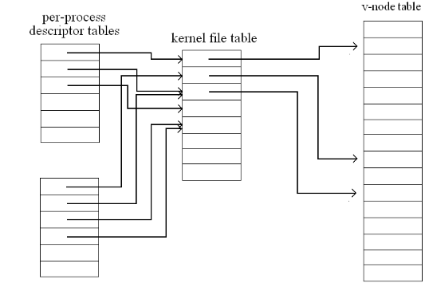

## File Concept

+ 这个概念只是给用户看的，对于机器而言并无区别，都是**逻辑空间**上一段连续存储的二进制串
+ Types：
	+ Data
		1. numeric
		2. character
		3. binary
	+ Program
		1. Source
		2. Object
		3. Executable

## File Structure

> 操作系统并不负责解析这些文件结构，这些文件结构的解析由应用程序完成
### None

+ sequence of words, bytes

### Simple record structure

+ Lines
> e.g. CSV files
+ Fixed length
> e.g. Database files
+ Variable length
> e.g. 
### Complex Structures

+ Formatted document
> e.g. XML, JSON
+ Relocatable load file

## File Attributes

+ Name：供用户看的文件名
+ Identifier: Unique tag(number)，供操作系统辨别不同文件，不同目录下的文件可以同名，但显然不能有同样的ID
+ Type: needed for systems that support different types
+ Location: pointer to file location on device
+ Size: current file size
> 除了文件本身，还有其他信息，真实size会比文件本身的size要大
+ Protection: controls who can do reading, writing, executing
+ Time, date, and user identification: data for protection, security, and usage monitoring

> Information about files are kept in the ***directory structure***(目录文件，用于查找其他文件), which is maintained on the disk

## File Operations

+ **Open**: 实际上是搜索一个文件，对用户表现为打开文件
+ **Close**: 实际上是从内存将文件写回磁盘的过程，对用户表现为关闭文件

### Open-file table

+ `Open()` system call returns a pointer to an entry in the **open-file table**
+ File Control Block, **FCB**, ( per file ) containing details about ownership, size, permissions, dates, etc.
+ Per-process table
	+ Current file pointer
	+ Access rights
	+ ……
+ System-wide table

+ 进程需要维护的文件信息：
	+ File pointer: pointer to last read/write location, per process that has the file open 
	+ File-open count: counter of number of times a file is open–to allow removal of data from open-file table when last processes closes it
	+ Disk location of the file: cache of data access information–system doesn’t need to read it from disk for every operation.
	+ Access rights: per-process access mode information

### Open-file Locking

> File lock 由system call提供，对应的高级语言只是在调用system call

+ Shared lock(reaker)
+ Exclusive(writer)

+ Mandatory or advisory:
	+ Mandatory–access is denied depending on locks held and requested
	+ Advisory–processes can find status of locks and decide what to do

## File Type

+ 由应用程序设置
+ 文件头中会保存*Magic Bytes*，用于标识对应的文件类型

## Access Methods

#### Sequential Access
> 顺序读写，只能读写下一个
#### Direct Access(Random Accesss)
> 根据block number找到对应的修改位置

#### 二者的性能比较

+ Q: Sequential存在的意义何在？
+ A: 某些情况下快，见后

> 可以看到，顺序读写的速度远快于随机读写
+ 如果你需要寻找大量数据，随机读写的速度就会不如顺序读写
> 然而Memory也仍有性能差距，可能是由于prefetch的策略

#### 如何支持Direct Access

+ 通过索引文件/索引结构，记录每个信息的对应位置，比如B树/B+树，见数据库
+ Directory Structure——方便用户使用
+ Partition
	+ 每个分区中都有挂载一个文件系统
	+ 每个分区中都有一个目录
	+ 分区可以跨设备

#### Operations Performed on Directory

+ Search for a file
+ Create a file
+ Delete a file
+ List a directory
+ Rename a file
+ Traverse the file system–access every dir and file for backing up.

#### Directory
+ Single level
	+ 重名问题，分组问题
+ Two level
	+ 路径重名问题
	+ 文件重名问题
+ Tree-Structured Directories
	+ 搜索代价过大
	+ 实际文件系统中广泛使用
+ Acyclic-Graph Directories
	+ 在树形基础上出现link
	+ 软link？ 硬link？
	+ 需要保证无环，否则搜索会出现问题