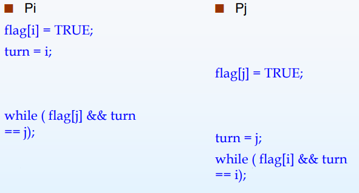

# 进程间通信

---

-   信号量 **semaphores**
-   共享内存 **shared memory**
-   消息传递 **message passing**
-   文件/管道 **pipe** （管道只支持单向传输，A 写 B 读，B 写 A 读）

# 同步

---

-   不同进程之间虽然相对隔离，一般情况下互不干扰，但是涉及一些共享资源的修改时，可能会产生一些冲突。

# 同步工具

---

## 竞态条件 Race condition

-   多个进程同时读/写同一个数据，导致数据与需要的不符，数据出现了错误的覆盖

## The Critical-Section Problem

-   Entry Section
-   Critical Section
-   Exit Section
-   Remainder Section
-   临界资源应该只有一个进程正在使用，即只有一个进程在临界态

### 解决方案

1. 临界互斥(mutual exclusion)：操作同一临界资源的临界区段应当互相排斥
2. 选择时间有限
3. 等待时间有限

> Kernel Code 中的解决方案

-   Q: 比如两个子进程同时 fork 一个父进程，如何分配 pid？
-   A: 使用抢占式内核与非抢占式内核，从硬件上防止冲突

#### Peterson's Algorithm

> Algorithm for Process $P_i$
+ `flag`用`ready`表示或许更直观，`ready[i]`,`ready[j]`若为`true`，则表明进程想要进入CS，根据对应的`turn`的值决定哪个进程进入CS
```C++
while (true) {
    ready[i] = TRUE;
    turn = j;
    while ( ready[j] && turn == j); 
        // CRITICAL SECTION 
    ready[i] = FALSE; 
        // REMAINDER SECTION 
}
```

> 严重的问题
+ 只适用于两个进程之间的问题
+ 对于代码的执行顺序有着严格要求，在现代处理器下的乱序执行下或编译器优化后语句顺序改变，就会发生错误。
> Memory Barrier
+ 通过引入这一屏障保证屏障前后的执行顺序

+ Memory Model
1. 强有序（strongly ordered）：进程对内存做的修改立刻对其他处理器可见
2. 弱有序（weakly ordered）：进程对内存做的修改不能立刻对其他处理器可见
> 比如，当cache采用write back策略时，并不会马上将数据更新至内存中，这就表现为weakly ordered


### Hardware Instructions

+ `test_and_set`
> Definition
``` C++
boolean TestAndSet (boolean *target) { 
	boolean rv = *target; 
	*target = TRUE; 
	return rv: 
}
```
> 原子性：无法同时对同一个target使用test and set
+ Solution using TestAndSet：**此时不再受到两个进程数量的限制**
```C++
while (true) { 
	while ( TestAndSet (&lock )) ; // do nothing 
		// critical section 
	lock = FALSE; 
		// remainder section 
}
```
> Proof:
+ TODO，有空再写

