## Base and Limit Registers 
+ A pair of base and limit registers define the logical address space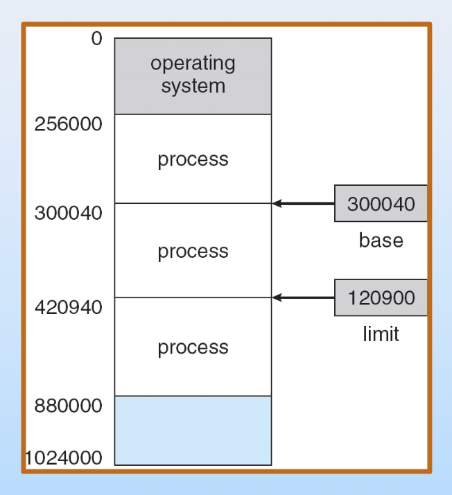

## Binding of Instructions and Data to Memory
+ Address binding of instructions and data to memory addresses can happen at three different stages.
	+ Compile time（编译时刻）: If memory location known a priori, absolute code can be generated; must recompile code if starting location changes  编译过程中就已经分配内存，BIOS是其中一种。
	+ Load time（装入时刻）: Must generate relocatable code if memory location is not known at compile time  进程将要执行而还未执行
	+ Execution time（执行时刻）: Binding delayed until run time if the process can be moved during its execution from one memory segment to another. Need hardware support for address maps (e.g., base and limit registers) 进程执行时动态的分配内存，编译和装载时都不知如何分配内存

## Logical vs. Physical Address Space
### Logical Address
+ 操作系统启动后才有此概念，是操作系统的一个feature
+ 方便CPU访问，**CPU访问的均为Logical Address**，通过**MMU**翻译为Physical Address.
+ 如果只有物理地址，需要自己维护段的起始与终止位置，在进程调度中非常麻烦

### MMU(Memory-Management Unit)
+ 这是CPU中的一个硬件
+ Hardware device that maps virtual to physical address  
+ In MMU scheme, the value in the relocation register is added to every address generated by a user process at the time it is sent to memory  
+ **The user program deals with logical addresses; it never sees the real physical addresses**
+ e.g. 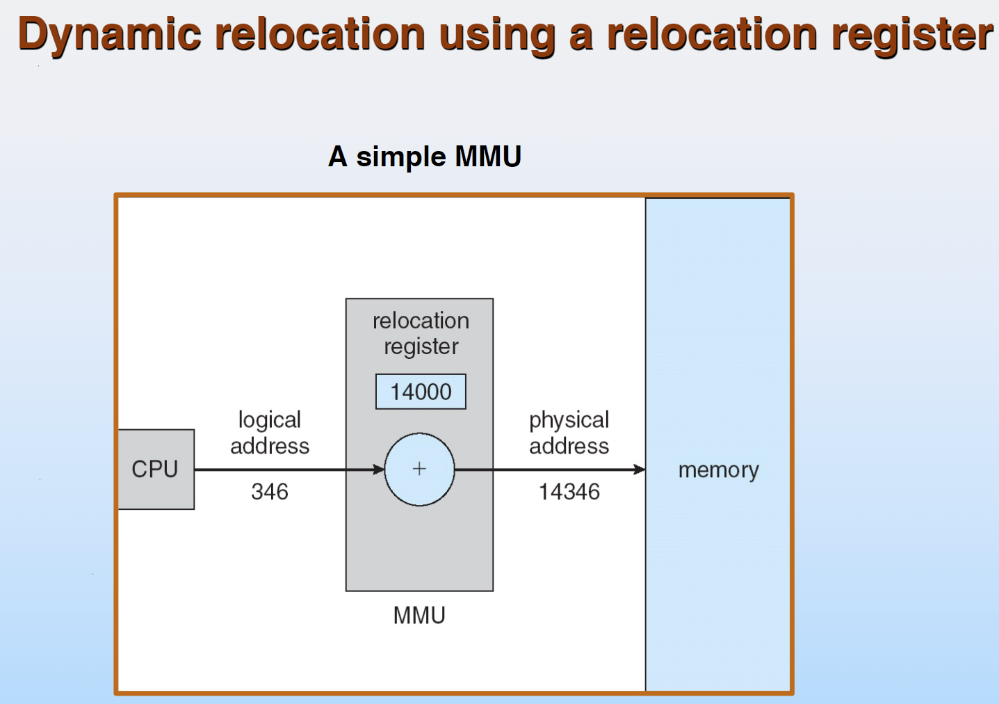
### 如何处理物理内存不足的情况
### 1. Dynamic Loading

+ Routine is not loaded until it is called  
+ Better memory-space utilization; unused routine is never loaded  
+ Useful when large amounts of code are needed to handle infrequently occurring cases  
+ No special support from the operating system is required implemented through program design

+ 很多模块并不经常使用，没必要全部load进内存，可以先不读进来；观察每个模块的使用概率，对于使用概率较低的模块，先不加载进内存，只有在用到时，再进行加载并装载。

### 2. Dynamic Linking

+ Linking postponed until execution time  
+ Small piece of code, stub, used to locate the appropriate memory-resident library routine  
+ Stub replaces itself with the address of the routine, and executes the routine  
+ Operating system needed to check if routine is in processes’ memory address  
+ Dynamic linking is particularly useful for libraries  
+ System also known as shared libraries  
+ Relinking of new library not needed

+ 不同进程用到相同的library，多进程可以共享，加载一份即可

### 3. Swapping 

+ A process can be swapped temporarily out of memory to a backing store, and then brought back into memory for continued execution  
+ **Backing store** – fast disk large enough to accommodate copies of all memory images for all users; must provide direct access to these memory images  
+ **Roll out, roll in** – swapping variant used for priority-based scheduling algorithms; lower-priority process is swapped out so higher-priority process can be loaded and executed  
+ Major part of swap time is transfer time; total transfer time is directly proportional to the amount of memory swapped  
+ Modified versions of swapping are found on many systems (i.e., UNIX, Linux, and Windows)  
+ System maintains a ready queue of ready-to-run processes which have memory images on disk

+ 进程运行过程中超出了原先分配的内存，或者整个主存溢出，将其中目前不需要的一部分放回到disk上
+ Swap分区（backing store），按照内存格式进行磁盘格式化

> Linux swap为什么一般设为物理内存的两倍？ 
+ A：

+ 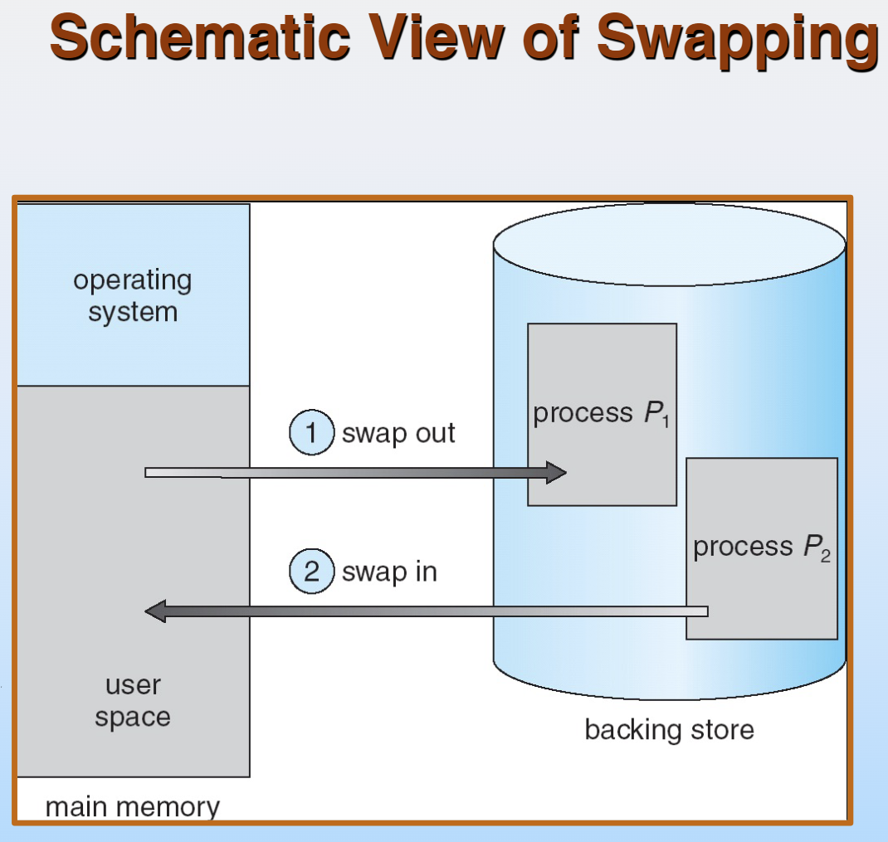

## 内存分配（用户态）

### 1. Contiguous Allocation

+ 连续分配
+ 所有进程在运行时都可以拥有一段连续的内存空间
+ Operating system maintains information about: 
	+ a) allocated partitions 
	+ b) free partitions (hole) 必须要有一整块可用内存才能分配给对应进程
+ 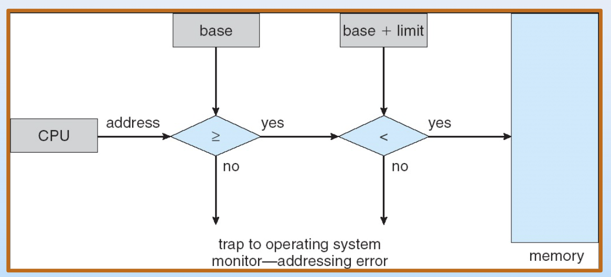
+ e.g. 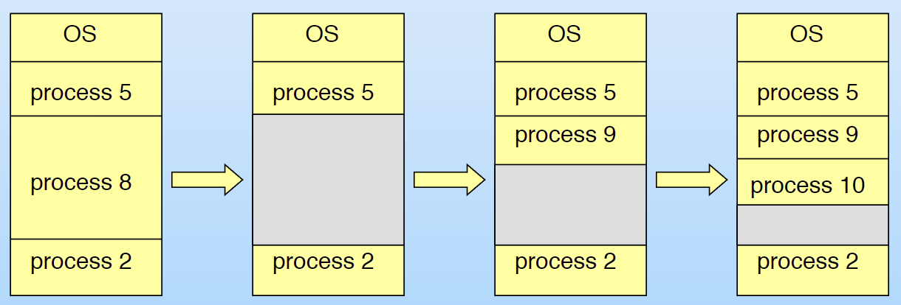

### Dynamic Storage-Allocation Problem

+ How to satisfy a request of size n from a list of free holes 
	+ First-fit: Allocate the first hole that is big enough  
	+ Best-fit: Allocate the smallest hole that is big enough; must search entire list, unless ordered by size  Produces the smallest leftover hole  
	+ Worst-fit: Allocate the largest hole; must also search entire list  Produces the largest leftover hole
+ First-fit and best-fit better than worst-fit in terms of speed and storage utilization

### Fragmentation

+ External Fragmentation – total memory space exists to satisfy a request, but it is not contiguous
> 分配后有很多细小的空间没有用上，作为碎片存在
+ Internal Fragmentation (refer to the textbook p287) – allocated memory may be slightly larger than requested memory; this size difference is memory internal to a partition, but not being used  Reduce external fragmentation by **compaction**  
> 进程内部分配了但没有使用的空间
+ Shuffle memory contents to place all free memory together in one large block  Compaction is possible only if relocation is dynamic, and is done at execution time  I/O problem 
	+ Latch job in memory while it is involved in I/O 
	+ Do I/O only into OS buffers  
+ Another solution to external frag. is non-contiguous allocation

### 2. Paging

+ 为了解决连续分配机制在分配过后留下的“洞”全都不够新进程使用的情况
+ Logical address space of a process can be noncontiguous; process is allocated physical memory whenever the latter is available  
+ Divide physical memory into fixed-sized blocks called **frames** (size is power of 2, **between 512 bytes and 8,192 bytes**)  将物理内存分成一个个小块
+ Divide logical memory into blocks of same size called pages  
+ Keep track of all free frames  
+ To run a program of size n pages, need to find ***n*** free frames and load program  
+ Set up a page table to translate logical to physical addresses Internal fragmentation
+ 分块后，有了换页机制后，需要一个页表进行页的索引，因为一个进程可能用到许多页面

#### Address Translation Scheme
+ Address generated by CPU is divided into:  
	+ Page number (p) – used as an index into a page table which contains base address of each page in physical memory  
	> 页号：$2^{m-n}$个page
	+ Page offset (d) – combined with base address to define the physical memory address that is sent to the memory unit
	> 页大小：$2^n$ bits
 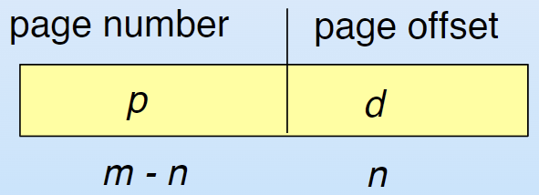
 + For given logical address space $2^m$ and page size $2^n$
> Paging Hardware
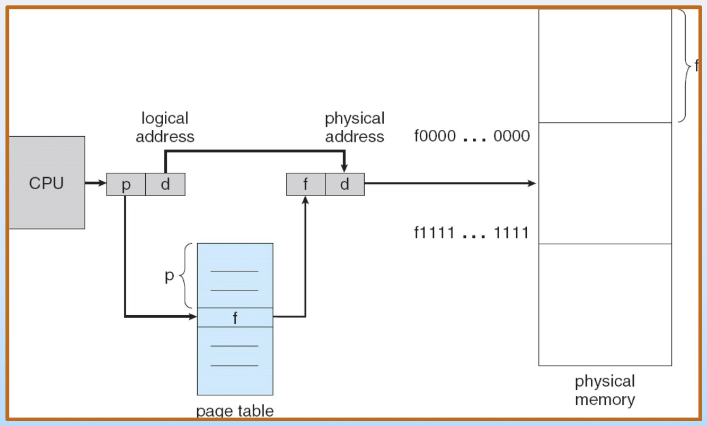
+ 通过Page Table将Logical Address(每个进程都有，可以视作一致，即各自都认为自己能够支配这么多内存空间)转化为Physical Address，不同进程中相同的逻辑地址会映射到不同的物理地址
> Paging Model of Logical and Physical Memory
+ 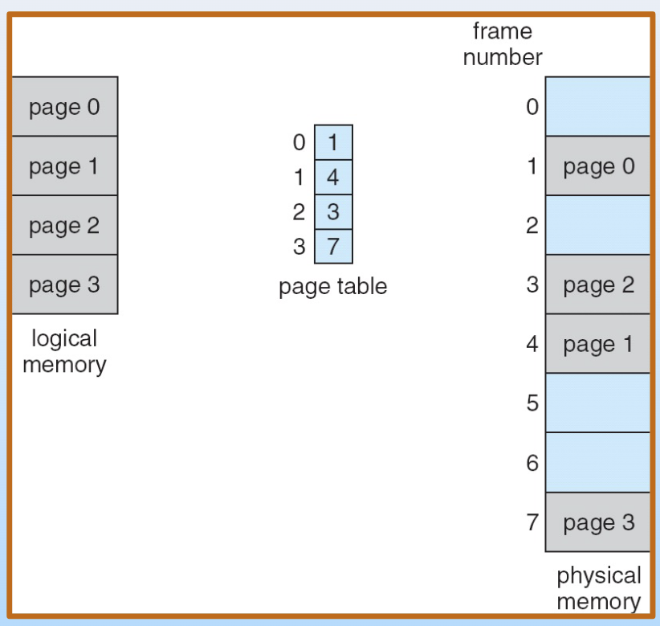
+ e.g. 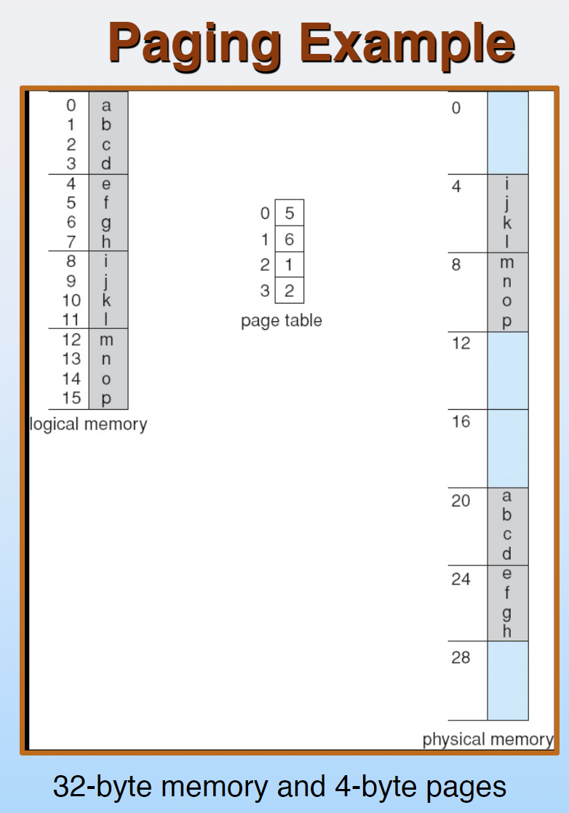
+ 在分配空间前：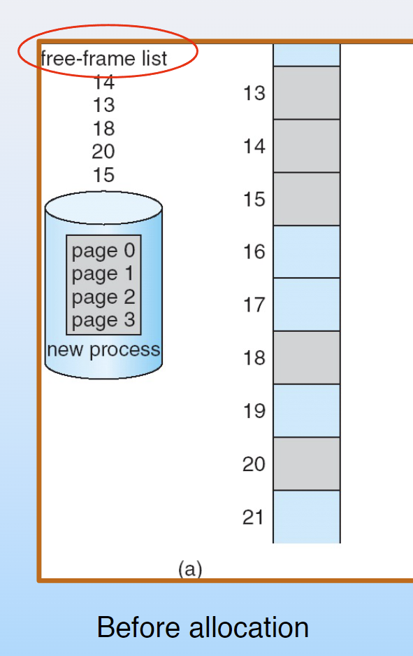
+ 在分配空间后：(可以看到不同页面在物理内存中并不需要连续)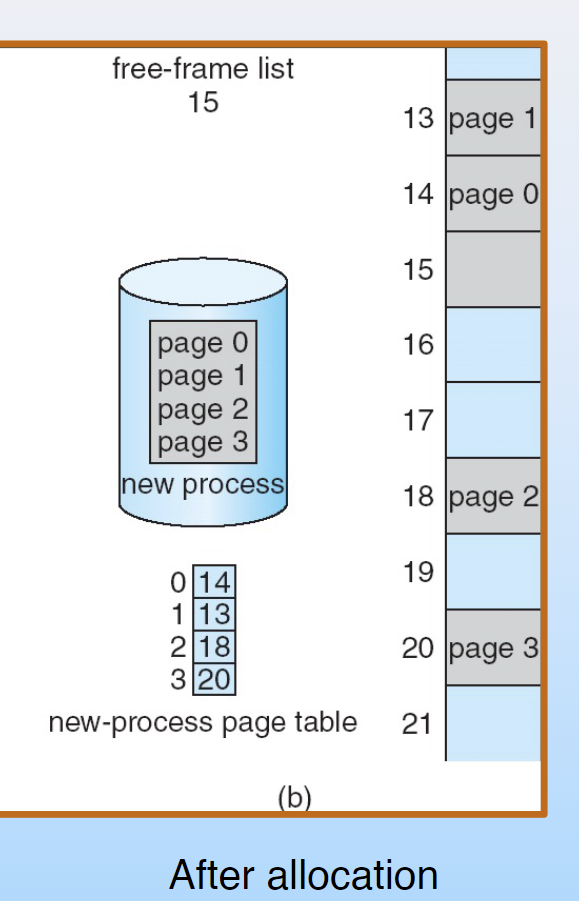

## Hardware Implementation of Page Table

+ 通过分页，可以减少internal fragmentation
+ **页表存储在内存中**，每个进程都有一个自己的页表
+ Page table is kept in main memory  
+ ***Page-table base register (PTBR)*** points to the page table  
+ ***Page-table length register (PTLR)*** indicates size of the page table  
+ In this scheme every data/instruction access requires two memory accesses. One for the page table and one for the data/instruction.  
+ The two-memory-access problem can be solved by the use of a special fast-lookup hardware cache called associative memory or **translation look-aside buffers** (TLBs 转换旁视缓冲, 一称快 表)  
+ Some TLBs store **address-space identifiers (ASIDs)** in each TLB entry – uniquely identifies each process to provide address- space protection for that process
> 那么页表有多大呢？
+ $2^p$（页号数量）个物理页号大小

### TLB
+ 硬件搜索，类似于寄存器
+ 真实的TLB是一个三维数组，还需要记录哪个进程的序号，因为是供所有进程共享的，而不像页表是每个进程均有的。
+ 和计组里的一样，不写了
+ parallel search

+ Address translation (p, d)  
	+ If p is in associative register, get frame # out  
	+ Otherwise get frame # from page table in memory
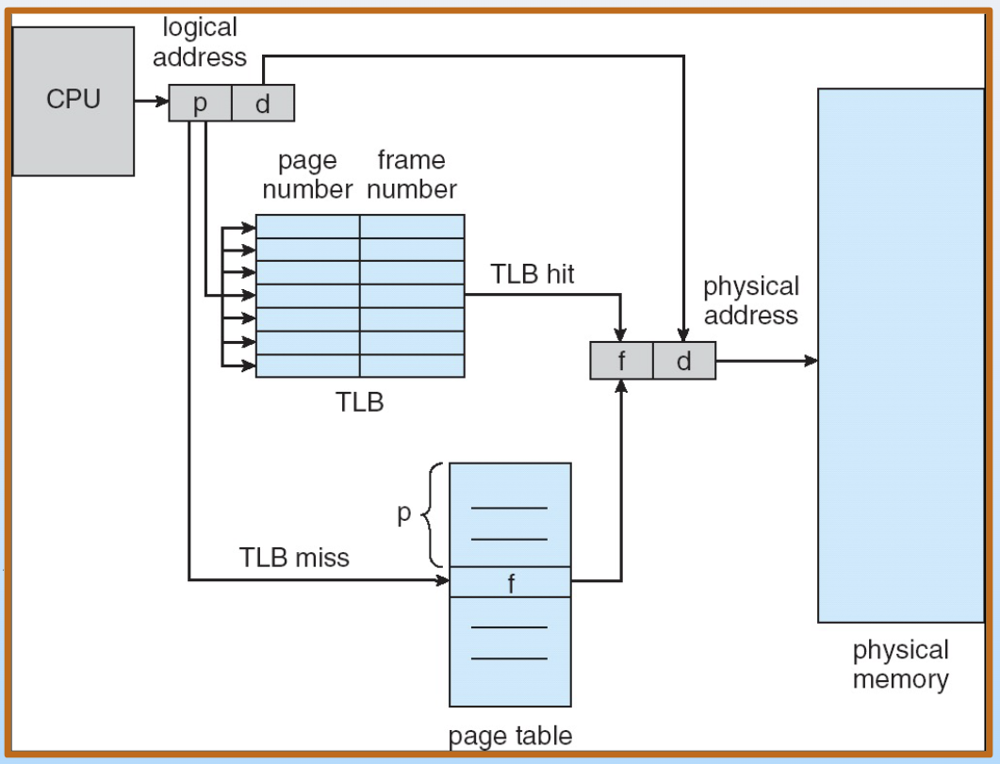

### Effective Access Time
+ EAT的计算
+ Associative Lookup = ε time unit
+ Assume memory cycle time is 1 microsecond
+ Hit ratio – percentage of times that a page number is found in the associative registers; ratio related to number of associative registers
+ Hit ratio = α  
+ Effective Access Time (EAT) EAT = (1 + ε) α + (2 + ε)(1 – α) = 2 + ε – α
+ 减小转换代价，尽量让程序能在TLB中找到对应的物理页号
### Memory Protection in Page Scheme
+ 引入valid位，valid代表映射关系存在，invalid代表映射关系不存在
+ e.g. 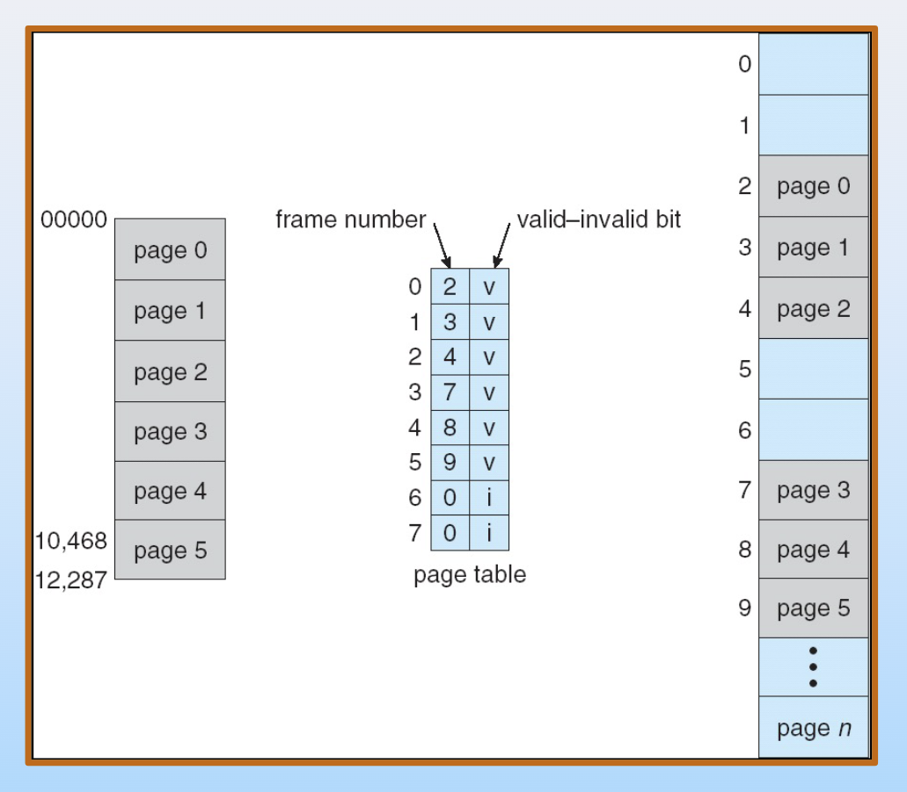
> 为什么不置零，而要增加一位valid位呢？
+ 因为实际使用过程中，内存会有释放的情况，通过valid位可以更方便的确定该映射位置的物理内存是否被释放。

### Shared Pages

+ 进程之间全局变量相互不可见，但是通过分页机制，可以实现两个进程共用一块物理内存
+ e.g. 可以看到，实际上三个进程有映射到同一物理地址的部分，通过进程调度时的内存分配，可以实现物理内存的共用：

### Structure of the Page Table

+ 多级页表
+ 以下是一个Two-Level Page Table: 
> 二级页表的EAT是什么：3次访问，可见TLB的重要性
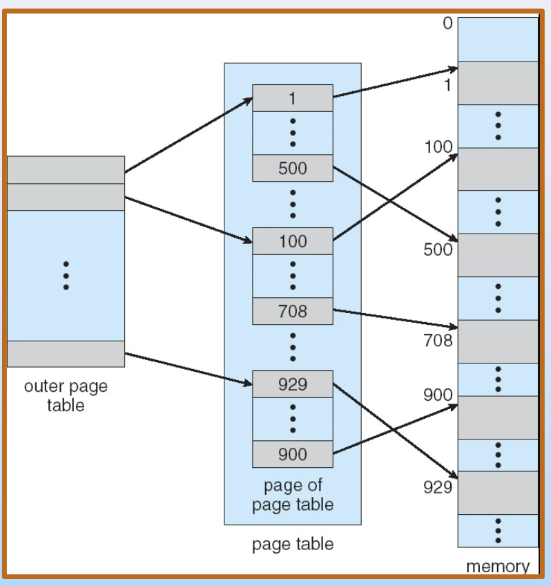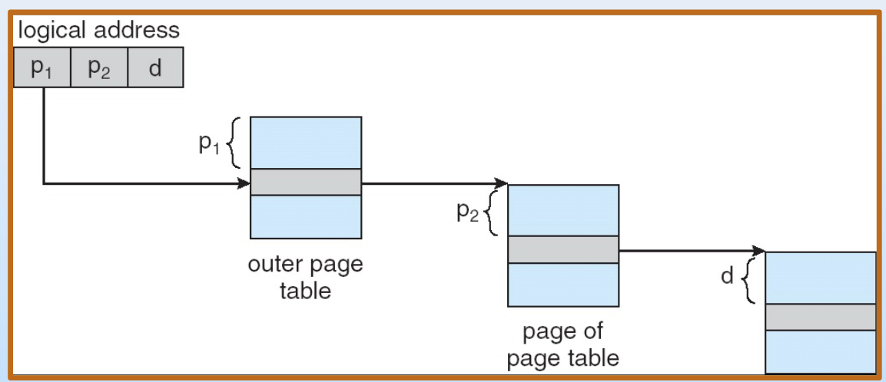
+ 实际上中间这一层没有映射的不会有pagetable（即通过outer page table知道是否存在映射，不存在映射则不建立下一级的pagetable），从而节省了空间。
+ 多级页表以此类推

#### Hashed Page Tables

+ 通过Hash函数映射到对应地址

#### Inverted Page Table

+ 比较数量过高
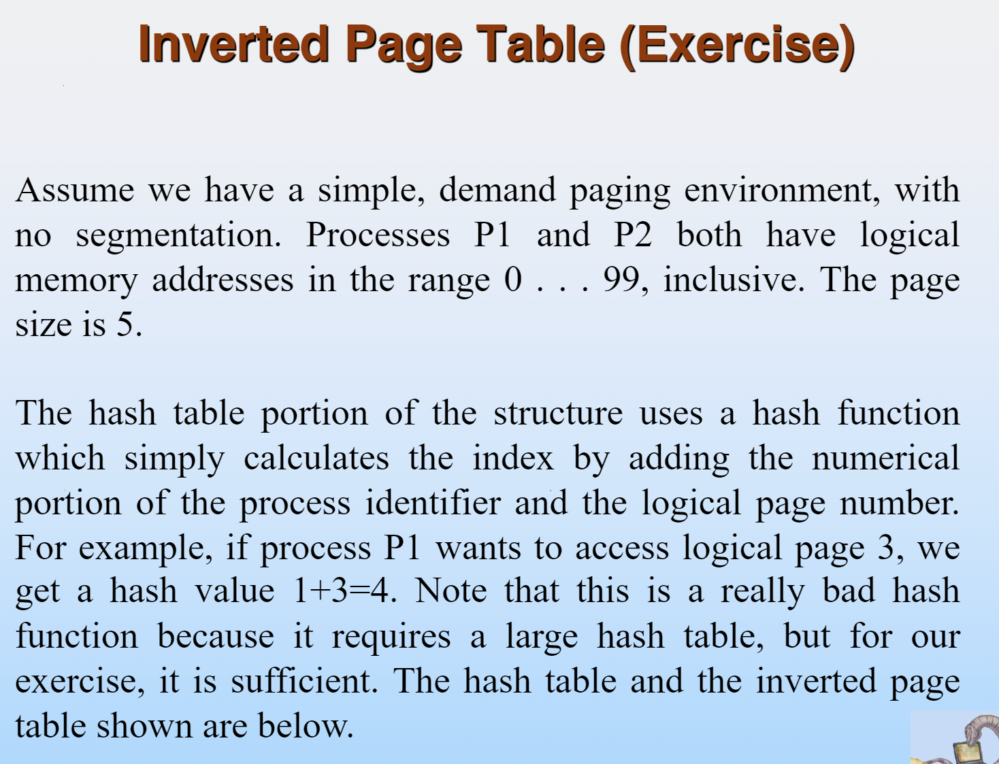

## Exercise

+ 一会再写